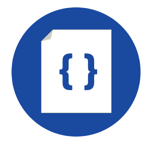
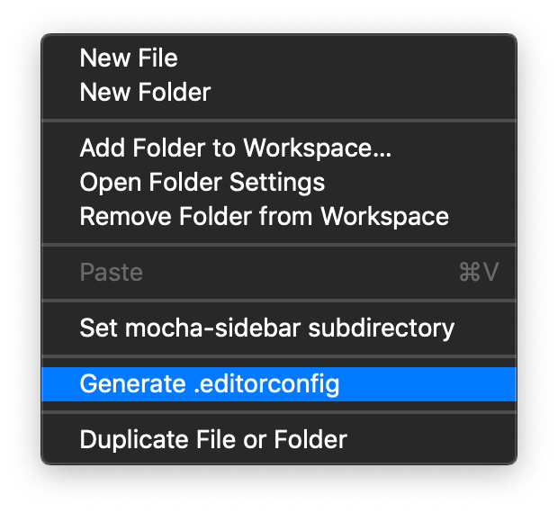
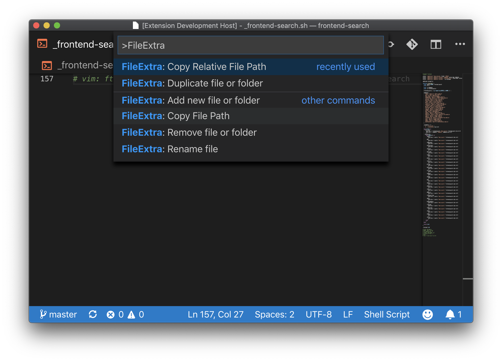

# VSCode File Extra

> Working with files in VSCode like a boss 😎

## VSCode Marketplate

You can check more about the package on [VSCode File Extra page in VSCode Marketplace](https://marketplace.visualstudio.com/items?itemName=willmendesneto.vscode-file-extra).

## Install

Press `F1` or type `cmd+shift+p` or `cmd+shift+p`, type `ext install` and press [Enter]. After that search for `vscode-file-extra`.

## Features

### Editor Explorer

Go to the explorer list of files and folder and click on the file.

Options:

- `Duplicate File or Folder`: Duplicates File or Folder based on the focus location;

### Command palette

Type `cmd+shift+p` or `cmd+shift+p` for open the command pallete. All the commands have the prefix "FileExtra: ". So, after that, you can select one of these commands pressing [Enter] to confirm, or [Escape] to cancel.

### Keyboard shortcuts

- Add new file or folder - `shift+alt+n shift+alt+f`
- Copy file name - `shift+alt+f shift+alt+n`
- Copy file path - `shift+alt+c shift+alt+f`
- Copy relative file path - `shift+alt+c shift+alt+r`
- Delete/Remove file or folder - `shift+alt+r shift+alt+m`
- Duplicate file or folder - `shift+alt+c shift+alt+p`
- Rename file - `shift+alt+m shift+alt+v`

## Requirements

If you have any requirements or dependencies, add a section describing those and how to install and configure them.

## Extension Settings

- `fileExtra.openFileAfterDuplication`: Automatically open newly duplicated files
- `fileExtra.closeFileAfterRemove`: Automatically close file in editor after remove

### Run tests

1. Run `npm test` for run tests. In case you want to test using watch, please use `npm run tdd`

### Publish

this project is using `vsce` package to publish, which makes things straightforward. EX: `vsce publish <patch|minor|major>`

> For more details, [please check vsce package on npmjs.com](https://www.npmjs.com/package/vsce) and read VSCode docs ["Publishing Extension"](https://code.visualstudio.com/api/working-with-extensions/publishing-extension)

## Changes

See [CHANGELOG.md](./CHANGELOG.md) for more details.

## Contributing

Feel free to contribute for this extension. You can find more details in our [How to Contribute](./CONTRIBUTING.md) docs

## Author

**Wilson Mendes (willmendesneto)**

- <https://plus.google.com/+WilsonMendes>
- <https://twitter.com/willmendesneto>
- <http://github.com/willmendesneto>
